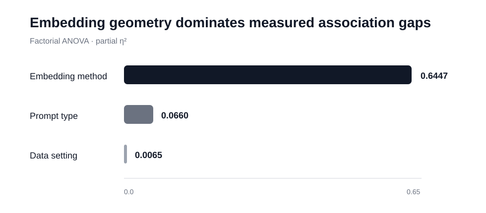
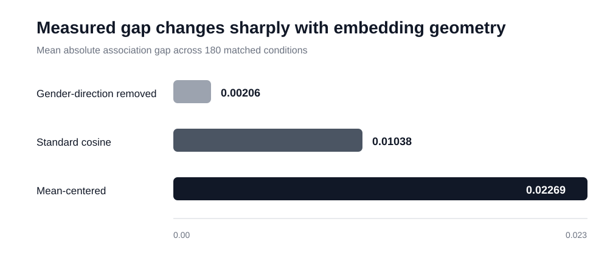

# CLIP Gender Bias Geometry

### A controlled study of occupational gender association gaps in CLIP

[](https://openreview.net/forum?id=ve0WcrVkcE)


Paper companion code for a controlled study of **occupational gender association gaps in CLIP**. The central question is not only whether a gap can be measured, but **how strongly the measurement depends on the evaluation protocol itself**.

> **Research question:** When CLIP is evaluated for occupational gender association gaps, which choice matters most: data composition, prompt formulation, or embedding geometry?

**Paper:** [OpenReview · ve0WcrVkcE](https://openreview.net/forum?id=ve0WcrVkcE)  
**Notebook:** [`notebooks/clip_gender_bias_geometry.ipynb`](notebooks/clip_gender_bias_geometry.ipynb)  
**Exact results:** [`docs/RESULTS.md`](docs/RESULTS.md)  
**Methodology:** [`docs/METHODOLOGY.md`](docs/METHODOLOGY.md)

---

## Main result

The factorial analysis shows that **embedding geometry is the dominant source of variation in the measured absolute gender association gap**.

<p align="center">
  
</p>

| Factor | Partial η² |
| --- | ---: |
| **Embedding method** | **0.644729** |
| Prompt type | 0.066000 |
| Data setting | 0.006459 |

The corresponding ANOVA term for embedding method has **F = 455.503457** and **p = 1.55 × 10⁻¹¹³** in the archived experiment.

Matched comparisons across 180 identical data-setting × prompt × occupation conditions show that the measured gap changes substantially when the representation geometry changes:

<p align="center">
  
</p>

| Embedding method | Mean absolute gap |
| --- | ---: |
| **Gender-direction removed** | **0.002056** |
| Standard cosine | 0.010381 |
| Mean-centered | 0.022689 |

The projection of occupation text embeddings onto the estimated image-derived gender direction is also almost perfectly aligned with the signed association gap under the baseline geometry (**Pearson r = 0.999851**, N=60).

> **Interpretation boundary:** this does not show that removing one linear direction makes CLIP generally fair. It shows that this occupational association metric is highly sensitive to the geometry of the representation space used to compute it.

---

## Experimental design

The study uses OpenAI **CLIP ViT-B/32** and a controlled subset of **FairFace**.

- Age group: **30–39**
- Controlled base pool: **4,200 images**
- Sampling control: **7 race groups × 2 genders × 300 images**
- Occupation probes: **20**
- Data settings: **3**
- Prompt formulations: **3**
- Embedding methods: **3**
- Total occupation-level conditions: **540**

Race is used only as a sampling-control variable in this experiment; it is not the target research variable.

### Factorial conditions

```text
3 gender-composition settings
× 3 prompt formulations
× 3 embedding geometries
× 20 occupations
= 540 conditions
```

The primary response variable is:

```text
signed_gap = mean(similarity_male) - mean(similarity_female)
absolute_bias = |signed_gap|
```

See [`docs/METHODOLOGY.md`](docs/METHODOLOGY.md) for the full construction rules.

---

## Embedding-space interventions

### Standard cosine

Normalized CLIP image and text vectors are compared directly.

```text
sim(x, t) = normalize(x) · normalize(t)
```

### Mean-centered geometry

A global image-embedding mean is removed before re-normalization.

```text
x' = x - μ
t' = t - μ
```

### Gender-direction removal

A direction is estimated from the controlled image pool:

```text
g = mean(image | Male) - mean(image | Female)
```

The projection onto `g` is removed from both image and text embeddings before re-normalization.

Reusable implementations are in [`src/clip_bias_geometry/geometry.py`](src/clip_bias_geometry/geometry.py).

---

## Repository layout

```text
.
├── README.md
├── CITATION.cff
├── REPRODUCIBILITY.md
├── NOTICE.md
├── requirements.txt
├── assets/
│   ├── factor_contribution.svg
│   └── embedding_method_comparison.svg
├── docs/
│   ├── METHODOLOGY.md
│   └── RESULTS.md
├── notebooks/
│   └── clip_gender_bias_geometry.ipynb
├── scripts/
│   ├── run_experiment.py
│   └── analyze_results.py
├── src/
│   └── clip_bias_geometry/
│       ├── __init__.py
│       ├── geometry.py
│       ├── metrics.py
│       ├── prompts.py
│       └── statistics.py
└── results/
    └── key_results.csv
```

The repository is organized as a **paper companion artifact**: end-to-end execution lives in `scripts/`, reusable research code lives in `src/`, the notebook provides an auditable walkthrough, and the reported numbers are recorded separately in `docs/RESULTS.md`.

---

## Reproduce

### 1. Clone

```bash
git clone https://github.com/ERRT-ai/clip-gender-bias-geometry.git
cd clip-gender-bias-geometry
```

### 2. Create an environment

```bash
python -m venv .venv
source .venv/bin/activate   # Windows: .venv\Scripts\activate
pip install -r requirements.txt
```

### 3. Run the full factorial experiment

```bash
python scripts/run_experiment.py
```

This step prepares the controlled FairFace pool, encodes images and prompts with CLIP, caches image embeddings, constructs the three embedding views, and writes the 540-row factorial table under `artifacts/results/tables/`.

### 4. Run the statistical analysis

```bash
python scripts/analyze_results.py
```

For expected outputs and reproducibility notes, see [`REPRODUCIBILITY.md`](REPRODUCIBILITY.md).

---

## Statistical analysis

The reference experiment uses:

- Type-II factorial ANOVA
- partial η² effect sizes
- matched paired t-tests
- Wilcoxon signed-rank tests
- bootstrap confidence intervals
- Pearson and Spearman correlations

The exact archived results, including p-values and matched-comparison statistics, are listed in [`docs/RESULTS.md`](docs/RESULTS.md).

---

## Responsible interpretation

This is a **measurement study**, not a fairness certification framework.

- FairFace provides binary gender labels and therefore does not represent the full spectrum of gender identity.
- Measured association gaps depend on the dataset, prompt set, demographic definitions, similarity geometry, and evaluation protocol.
- FairFace is an external dataset and is **not redistributed** in this repository.
- Reducing this metric does not establish the absence of other biases or harmful model behavior.
- Gender-direction removal is used here as a representation-space probe, not as a universal debiasing guarantee.

---

## Citation

GitHub can read citation metadata from [`CITATION.cff`](CITATION.cff). For the paper itself, please use the final bibliographic metadata shown on [OpenReview](https://openreview.net/forum?id=ve0WcrVkcE).

---

## Acknowledgements

This project builds on OpenAI CLIP, FairFace, PyTorch, SciPy, statsmodels, NumPy and pandas. Please follow the original licenses and usage terms of all third-party models and datasets.
